# Hyperliquid attack taxonomy

This is the visual mental model for the repository. It organizes the Hyperliquid attack surface into five system surfaces and then maps incidents to the specific mechanism that failed or was abused.

## Mermaid diagram

```mermaid
flowchart TD
    A[Hyperliquid Ecosystem]

    A --> B[Core Protocol]
    A --> C[Market Structure]
    A --> D[User Accounts]
    A --> E[Ecosystem Apps]
    A --> F[Infrastructure and Crisis Path]

    B --> B1[Risk Engine]
    B --> B2[Liquidation System]
    B --> B3[Portfolio Margin]
    B --> B4[HLP Backstop]
    B --> B5[Validator Governance]

    C --> C1[Order Book Liquidity]
    C --> C2[Mark Price Logic]
    C --> C3[Oracle Anchors]
    C --> C4[Cross-Exchange Pricing]

    D --> D1[Private Keys]
    D --> D2[Account Permissions]
    D --> D3[Bridge-Out Behavior]

    E --> E1[HyperEVM Contracts]
    E --> E2[Routers and Operators]
    E --> E3[Protocol Integrations]

    F --> F1[Nodes and APIs]
    F --> F2[Bridge Dependencies]
    F --> F3[Emergency Intervention]

    C1 --> X1[Thin Market Manipulation]
    C2 --> X2[Mark Price Distortion]
    C3 --> X3[Oracle Manipulation]
    B1 --> X4[Toxic Position Transfer]
    B2 --> X5[Liquidation Cascade]
    B3 --> X6[Margin Model Abuse]
    D1 --> X7[Private Key Compromise]
    E2 --> X8[Arbitrary Router Calls]
    E3 --> X9[Ecosystem Trust Failure]
    F3 --> X10[Governance Override / Validator Put]
    F1 --> X11[Reconnaissance / Platform Stress]

    X3 --> I1[SNX]
    X6 --> I2[ETH Margin Drain]
    X4 --> I3[JELLY]
    X1 --> I4[POPCAT]
    X8 --> I5[Hyperdrive]
    X7 --> I6[Key Compromise]
    X9 --> I7[HyperVault]
    X11 --> I8[Lazarus-linked activity]
```

## Rendered asset
See `../assets/hyperliquid_attack_surface_map.png`.

## Coverage table

| Surface | Representative mechanisms | Anchor incidents |
|---|---|---|
| Core protocol | liquidation inheritance, margin abuse, HLP loss absorption | ETH margin drain, JELLY |
| Market structure | thin-book manipulation, oracle / anchor abuse, spoofing | SNX lead, JELLY, POPCAT |
| User accounts | private-key compromise, abnormal bridge-out behavior | key compromise |
| Ecosystem apps | router abuse, permission boundary failure, trust failure | Hyperdrive, HyperVault lead |
| Infrastructure / crisis path | validator intervention, API / node logic risk, stress events | JELLY governance response, Lazarus lead |

## Deep dives
For a detailed taxonomy of HyperEVM smart contract vulnerabilities, see `hyperevm_vulnerability_taxonomy.md`.

## Interpretation rule
Do not confuse “loss happened on Hyperliquid” with “Hyperliquid core protocol had a code bug.” That distinction is the foundation of the repo.
